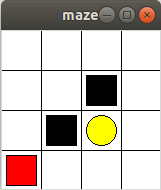
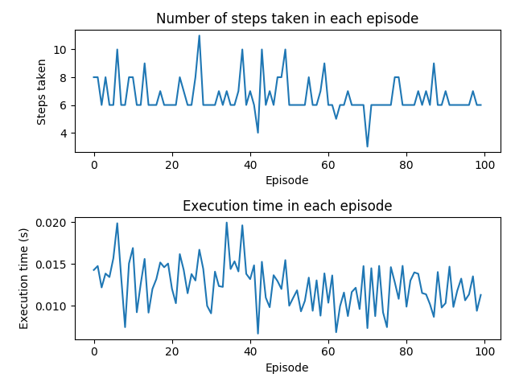
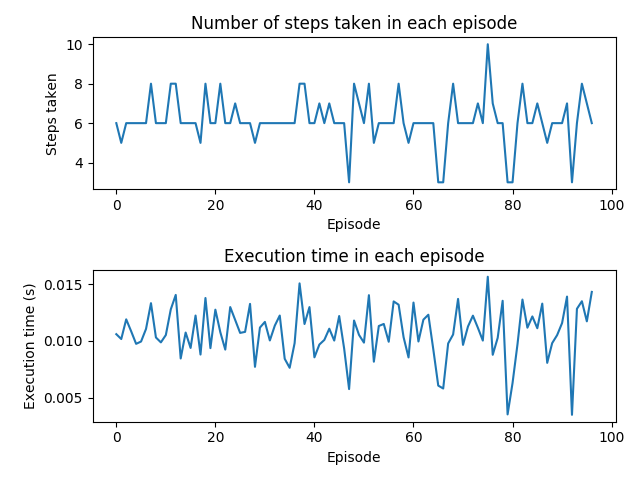

# Maze Environment Scenario Comparsion

## Maze Enviornment
The maze environment involves a 4x4 grid space that involves an red rectangle acting as an agent that traverses through the gird world to find the yellow oval target. The episode completes when the red rectangle has successfully reached the destination of the yellow oval. The agent starts on the top left corner. The grid space also contains black squares which act as black holes and terminate the episode if the agent intereacts with that grid module. The goal of the agent is to reach the target yellow oval with the least amount of steps it can take from the starting position.

## Steps per Episode Comparsion
The difference between DQN and Q - learning algorithms is notified through the osciallations produced in the normalisation of the optimal policy in the later episodes. This due to the exploration and exploitation comparative. As the Q - learning algorithm explores and exploits at the same time on the same network while the DQN has a two simultaneous networks one of which allows the DQN to explore while the target newtork allows it to exploit and choose an optimal policy. 

### QL focus Graphs

### DQN focus Graphs 

## Conclusion
The Q - learning provides a slight oscillation which is a negligible difference in the steps which are produced the runtimes are also quite similar seen in the graphs above there we can conclude it wouldn't provide much of a difference in the choosing of one algorithm over the other but for a slightly more normalised optimal policy generation the DQN could be chosen.
