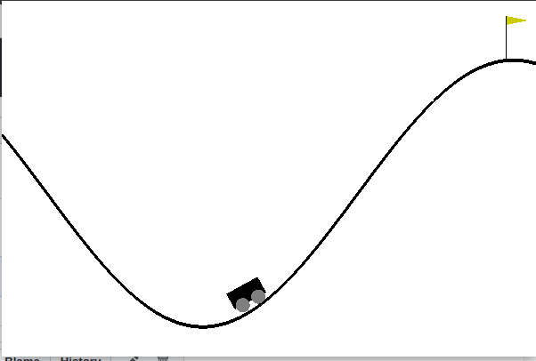
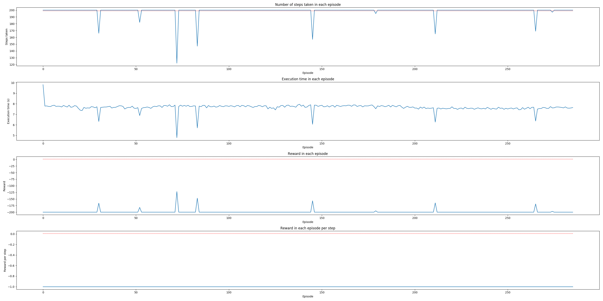
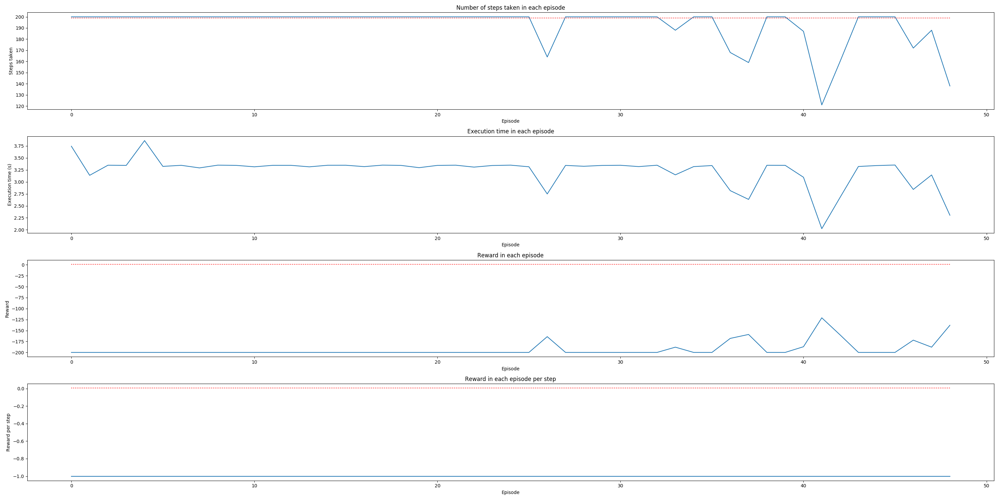

# Mountain Car Scenario Comparsion

## Mountain Car Enviornment
The mountain car environment involves a left mountain and right mountain that has a flag at position 0.5(and is the goal
). The episode completes when the car reaches the flag but must complete this task in 200 time steps or it has failed. The agent starts in the midddle of the two mountains between a random position of  -0.6 to -0.4 with no velocity. If the car goes beyond the left mountain it also fails. The total reward it can accumulate is 1 which is given at the flag position only but receives -1 for each  time step, until the goal position of 0.5 is reached. There is no penalty for climbing the left hill. The states that can be observed are its position from  -1.2 to 0.6 and velocity from -0.07 to 0.07. The actions the car can take is push left, right or no force. MountainCar-v0 is considered "solved" when the agent obtains an average reward of at least -110.0 over 100 consecutive episodes.

## Results

The results were graphed by running the code for both algorithms until 10 successful episode were completed this is indicated by the spikes in the graphs. Four graphs were computed with the last graph, rewards per step being redundant due to the nature of the environment. 

#### DQN focus Graphs 
Episodes for 10 successes: 280

#### Double DQN focus Graphs 
Episodes for 10 successes: 58

### Steps per Episode Comparsion
This is difficult to compare since the steps are capped at 200 steps so the only comparable thing is the frequency of successes. Double DQN had more successes towards the end while DQN's frequency was evenly spaced. It can be said that DQN displays random occurrences of successes, yet it does not learn from them. 

### Execution Time Comparison
The shortest time for DQN was 5 secs and for Double DQN was 2 secs, signifying that Double DQN takes less time to complete tasks successfully. 

### Reward Comparison
From the graphs, the highest reward for both algorithms were about the same, -125. During one of the three trials for Double DQN, the reward reached above -100. This never occurred for the two (hard won) trials for DQN.

## Conclusion
Double DQN is superior it is able to have 10 successes in less episodes this is because the pattern in the graph shows that it is clearly learning and so there's a cluster of successes at the end where in DQNs they appear more spread out and appear at random. Since it learning it also runs the episodes alot quicker even if it uses the about same number of steps in an episode this makes it much more computationally and time efficient. It is also worth mentioning that DQN crashed my computer 3 times so I would recommend using double dqn.
