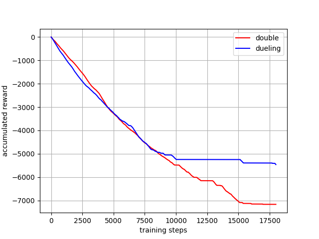
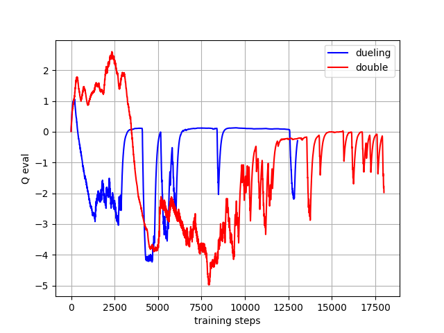
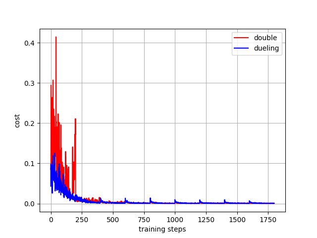

# Pendulum Comparison

Pendulum is a classic control environment which aims for the pole to remain upright vertically at 0 degrees. There are no episodic terminations, instead, only the steps and memory are taken into account. The reward gained for each action when there is no movement(i.e: pendulum is already upright) is 0, and for each time step, a reward of -1 is assigned. The lowest reward for each action is -16.2736044 since the pendulum can only move from -pi to pi. In essence, the goal is to remain at zero angle (vertical), with the least rotational velocity, and the least effort. Also note that there is no reward threshold to say that it has successfully achieved the goal.

## Note

We only use Double DQN and Duelling as we can't use DQN and simple Q learning algorithms in environments with continous actions spaces they can't handle the complexity

## Results

The Pendulum environment was executed and compared the algorithms: **double and dueling DQN**. The graphs for the Q-evaluation value, cost and accumulated reward was graphed against the number of steps. The code was run for 18000 steps. 

### Accumalative rewards vs steps
The main point to compare here is the behaviour of the graphs at the end, which one is flatter and flattens first. This indicates that the pendulum is upright and stays upright by not moving this means our agent doesn't take an action and our reward increase becomes 0. We can see in the graph that duelling dqn flattens first and is the smoothest indicating our duelling algorithm learns the ability to makes the pendulum stay upright for longer even if it may take more actions initially to get to that point.

### Q eval vs steps

When the Q-value increases above 0, it indicates that there is an overestimation. From the execution trials, double DQN consistently starts with very high overestimations, whereas, dueling DQN decays extremely fast. Both algorithms have similar results after the around 7500 episodes. 

### Cost vs steps

We can see duelling reaches our goal of zero first and tends to stay flatter with double having more jumps this indicates that duelling learns a lot faster than double.

## Conclusions

Duelling learns how to get to our goal faster and is able to remain upright longer, it also more accuratley estimates q values. Use Duelling but it doesn't take more memory 
